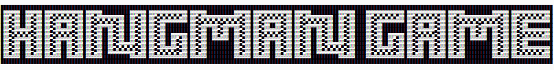

  

# About this project
This is a Python hangman game. You can play alone or with friends with the multiplayer mode. It is pretty basic and features 5 categories of words: fruits, animals, countries, programming, and sports.

# How to play

  

 
After opening the game, you will get this menu. You can either choose to play alone or with other people locally. Choose "Single Player" if you want to play alone or "Multiplayer if you want to play with other people.

  

 
If you chose a single player, you must enter letters to guess the word. You only have a limited amount of tries !
 
If you chose multiplayer, each player will try a letter, and the first who finds the word wins. But you also have a limited amount of tries !

# How to download
You can get the installer from 
[here](executable/Hangman_Game_Installer.exe)

